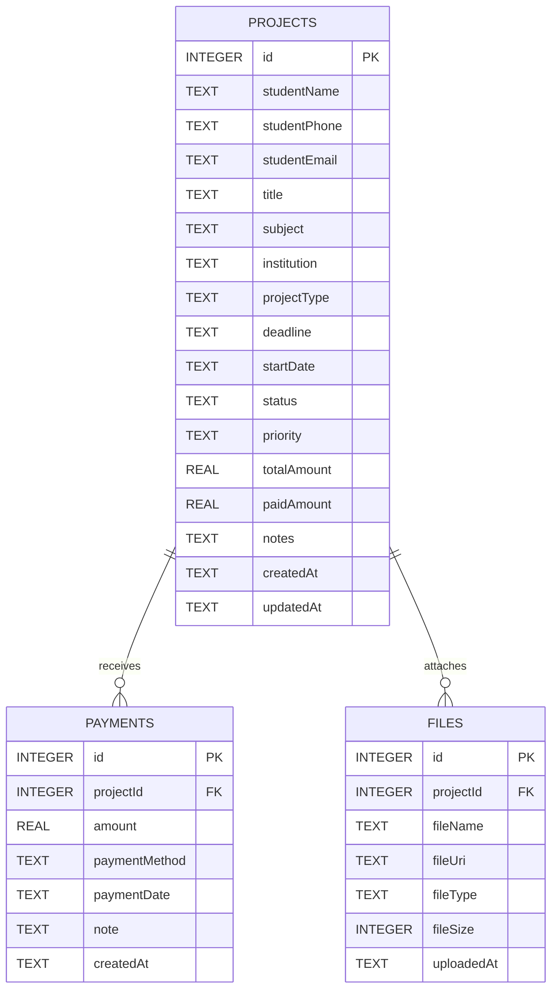

# Project Tracker

A professional, offline-first, locally secured mobile application for freelance developers, project managers, and tutors to track projects, client deliverables, milestones, attachments, and financial payments. 

Built with **React Native**, **Expo**, **TypeScript**, and **SQLite**, Project Tracker is designed to operate completely offline, safeguarding user data and privacy by keeping all databases, invoices, and reference documents directly on the physical device.

---

## 🚀 Key Features

*   📊 **Financial & Progress Dashboard**
    *   Real-time analytics mapping total, active, completed, and overdue projects.
    *   Live summaries of total revenue received, pending receivables, and monthly billing metrics.
    *   Urgent deadline alerts ("Due Soon") to prevent project SLA breaches.

*   📂 **Robust Project Management**
    *   Detailed project tracking including Title, Category/Subject, Client Details, Institution, Status, Priority, and custom notes.
    *   Granular project status workflows (Not Started, In Progress, Completed, Cancelled).

*   💳 **Milestone Payment Ledger**
    *   Log payments per project with details on payment date, payment methods (Cash, Bank Transfer, EasyPaisa, JazzCash, etc.), and reference notes.
    *   Automatic recalculation of project balances (Remaining/Due Amount) with dynamic visual progress bars.

*   📎 **Sandboxed Attachment Vault**
    *   Attach and manage reference files, assignment sheets, images, and documents directly from device storage.
    *   Automatic file copy to local app storage using standard iOS/Android sandboxing.

*   📄 **PDF Reports & Exports**
    *   Generate and export clean, formatted PDF records for individual projects or the entire ledger.
    *   **Auto-Open on Export**: Exported reports and documents launch immediately using native intent viewers for a seamless user experience.

*   💾 **Data Portability (Backup & Restore)**
    *   One-click full database exports to a single JSON snapshot file.
    *   Instant recovery from backups to ease device migrations.

---

## 🛠️ Tech Stack & Architecture

*   **Framework**: Expo (React Native) with TypeScript
*   **Database**: SQLite (`expo-sqlite`) for relational schema storage
*   **Filesystem**: `expo-file-system` for sandboxed file containment
*   **Document Picker**: `expo-document-picker` for attaching reference documents
*   **PDF Generation**: `expo-print` for rendering HTML templates to PDFs
*   **Sharing & Intents**: `expo-sharing` & `expo-intent-launcher` for instant document viewing
*   **Icons**: `lucide-react-native`
*   **Navigation**: React Navigation (Native Stack + Bottom Tab navigation flows)

---

## 🗄️ Relational Database Schema

The app utilizes a local SQLite database (`project-ledger.db`) with three primary tables linked via foreign key relationships:



---

## 📥 Getting Started

### Prerequisites

Ensure you have [Node.js](https://nodejs.org/) installed on your development machine.

### Installation

1. Clone the repository:
   ```bash
   git clone https://github.com/aryanmirza1/Assignment_ledger.git
   cd "Assignment Tracker"
   ```

2. Install dependencies:
   ```bash
   npm install
   ```

### Running Locally

To run the development server:

```bash
npx expo start
```

Press **`a`** to open in an Android emulator, **`i`** for iOS Simulator, or scan the QR code using the Expo Go application on your mobile device.

---

## 🏗️ Android APK Build (EAS CLI)

The project is pre-configured for cloud builds using Expo Application Services (EAS).

1. Install the EAS Command Line Interface:
   ```bash
   npm install -g eas-cli
   ```

2. Log in to your Expo account:
   ```bash
   eas login
   ```

3. Initiate the preview build (generates a installable `.apk` file):
   ```bash
   eas build --platform android --profile preview
   ```

---

## 🔒 Data Security & Device Integration

Project Tracker does not sync with external servers or cloud services. 
*   **SQLite Relational Data** is kept in the private application sandbox (`FileSystem.documentDirectory`).
*   **Exported Files** on Android are saved to user-selected directories using the *Android Storage Access Framework (SAF)*, granting users full control over document export destinations.
*   **Automatic Open Intent** leverages Android File Provider URIs (`getContentUriAsync`) to launch native system viewers (like Adobe Acrobat or Chrome PDF Reader) instantly when reports are downloaded.
